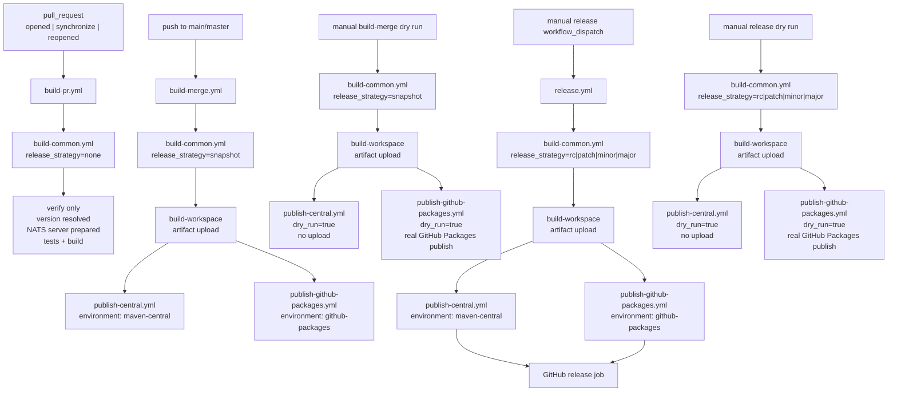

# How do the GitHub Actions workflows work?

This document explains the current CI/CD workflow layout in `spring-boot-4-nats`.

## Flow

## What each workflow does

## Workflow capabilities

- automatic version resolution per workflow run
- automatic snapshot publishing on pushes to `main` or `master`
- manual release publishing for `rc`, `patch`, `minor`, and `major`
- manual dry-run rehearsal for snapshot and release publishing
- git tag creation for release workflows
- GitHub release creation for manual releases
- GitHub release asset attachment for release workflows
- publish to GitHub Packages
- publish to Maven Central
- GitHub environments for publish and release stages
- GitHub deployments for visible release activity

### `build-pr.yml`

- Trigger: `pull_request` on `main` or `master`
- Types: `opened`, `synchronize`, `reopened`
- Calls `build-common.yml` with `release_strategy=none`
- Runs normal CI only
- Does not publish
- Does not upload the rewritten workspace artifact

### `build-merge.yml`

- Trigger: push to `main` or `master`
- Also supports manual `workflow_dispatch`
- Manual dispatch supports `dry_run=true`
- Calls `build-common.yml` with `release_strategy=snapshot`
- Produces the publishable workspace artifact
- Publishes snapshot outputs to:
  - Maven Central
  - GitHub Packages
- With `dry_run=true`, skips Maven Central upload but still exercises the GitHub publish path for branch rehearsal

### `release.yml`

- Trigger: manual `workflow_dispatch`
- Release strategies:
  - `rc`
  - `patch`
  - `minor`
  - `major`
- Supports `dry_run=true`
- Calls `build-common.yml` with the selected strategy
- Produces the publishable workspace artifact
- Publishes release outputs to:
  - Maven Central
  - GitHub Packages
- Creates a GitHub release after both publish jobs succeed
- Attaches the release assets to the GitHub release page
- With `dry_run=true`, skips Maven Central upload but still exercises GitHub package and release creation for branch rehearsal

### `build-common.yml`

This is the shared build pipeline.

It does the following:

1. Checks out the requested ref
2. Reads Java project metadata with `java-info-action`
3. Resolves the target project version from `release_strategy`
4. Rewrites the Maven version with `versions:set`
5. Clones and builds `nats-server`
6. Runs build and tests
7. For publish strategies only:
   - uploads the rewritten workspace as the `build-workspace` artifact
   - keeps the artifact for one day

## Why the publish jobs chmod `mvnw`

GitHub artifact upload does not preserve executable permissions reliably. The publish jobs restore the workspace artifact and run `chmod +x mvnw` before Maven commands.

That workspace artifact is the handoff between:

- the build job that determines version and produces artifacts
- the publish jobs that deploy exactly what was built

## Environments and deployments

The publish and release jobs use GitHub environments so they create deployment records in GitHub.

Current environment mapping:

- Central publish: `maven-central`
- GitHub Packages publish: `github-packages`

This makes release activity visible in GitHub Deployments instead of only in workflow logs.

## Version strategy notes

`build-common.yml` resolves the workflow version from the latest reachable git tag and the selected `release_strategy`, then rewrites the Maven version with `versions:set` for that run.

The checked-in Maven version is not used as release truth for workflow versioning.

The release jobs also do not trust a rewritten `pom.xml` as the version source. They resolve once from git tags, then pass the resolved version and build timestamp forward through the workflow artifact handoff.

The repository still contains historical Spring-line markers such as `+3.5`, but the workflow intentionally ignores build metadata for precedence and treats the latest semver tag as the source of truth.

Examples:

- `none` -> use the next snapshot line from the latest tag
- `snapshot` -> use the next snapshot line from the latest tag
- `rc` -> append or increment `-rc.N` from the latest tag line
- `patch|minor|major` -> bump the numeric core from the latest tag

Example normalization:

- latest tag `0.6.1+3.1`
- workflow snapshot version `0.6.2-SNAPSHOT`
- workflow patch release version `0.6.2`

If the repository has no reachable tags, the workflow falls back to a bootstrap base version of `0.0.0`.

Bootstrap examples:

- no tags + `none` -> `0.0.1-SNAPSHOT`
- no tags + `snapshot` -> `0.0.1-SNAPSHOT`
- no tags + `patch` -> `0.0.1`

## Reproducible builds

The workflow passes `-Dproject.build.outputTimestamp` from the checked-out commit timestamp so the build and publish jobs use the same reproducible timestamp value.

The Maven build also sets:

- `project.build.outputTimestamp=${git.commit.time}`
- `git-commit-id-maven-plugin` to populate `git.commit.time`

That keeps local reproducible-build checks and workflow publish jobs aligned.

## Dry run behavior

Dry runs use the same rewritten workspace artifact as live publish jobs. For this branch rehearsal they skip only Maven Central upload:

- `publish-central.yml` runs `./mvnw -B -Ppublish -pl nats-spring,nats-spring-boot-starter,nats-spring-cloud-stream-binder -am -DskipTests -Dgpg.skip=true -DskipPublishing=true package`
- `publish-github-packages.yml` still publishes the selected modules to GitHub Packages
- `release.yml` still creates the GitHub tag and release when the release strategy requires it

## Release assets

The release workflow uploads the publishable workspace artifact, restores it in the `create-release` job, and then attaches the release assets to the GitHub release page.

Current release assets:

- parent POM
- starter POM
- core JAR, sources JAR, javadoc JAR
- binder JAR, sources JAR, javadoc JAR

This exercises the real GitHub-side behavior while keeping Maven Central clean:

- snapshot version reuse and overwrite behavior
- RC, patch, minor, and major version resolution
- publish-from-artifact mechanics
- publish profile and javadoc wiring
